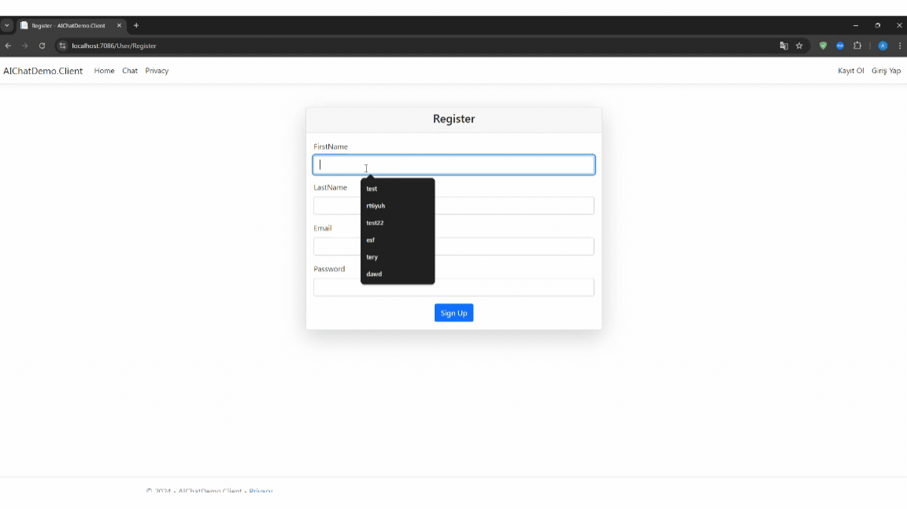
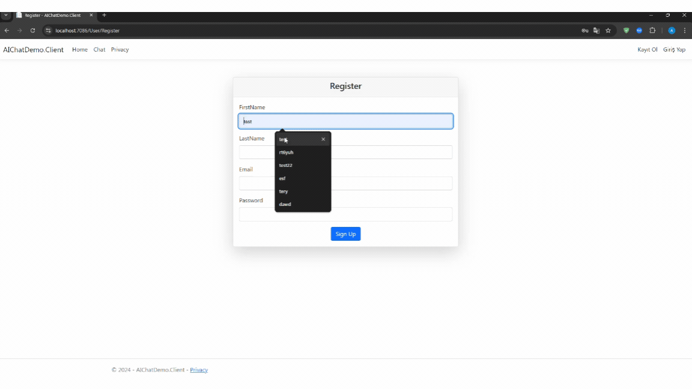
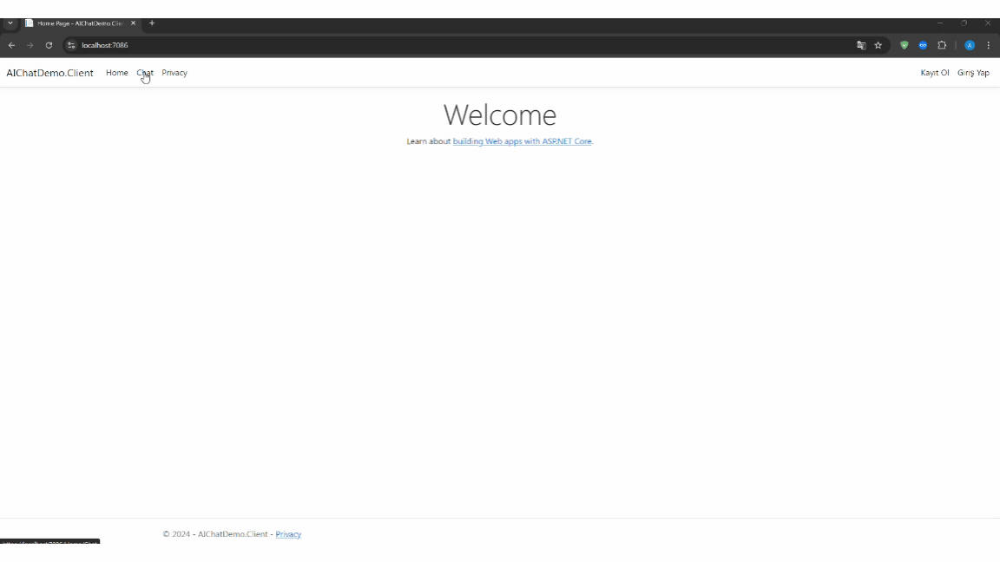
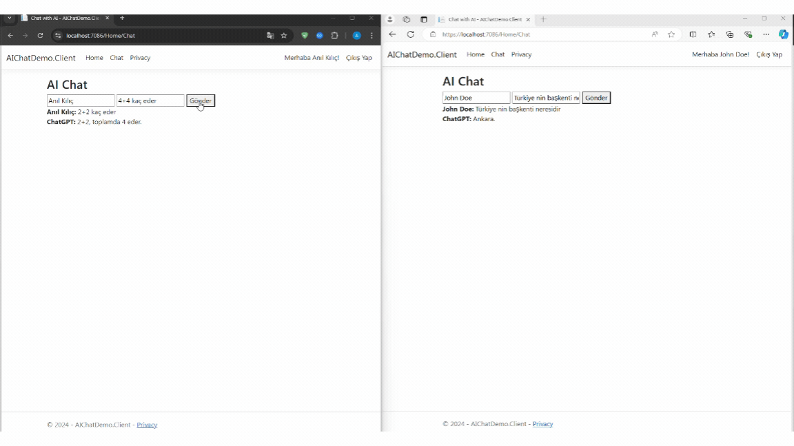

# AI Chat Demo

## Introduction

**AI Chat Demo** is a sample application designed to help you learn and reinforce your skills in real-time communication using SignalR and integrating OpenAI's ChatGPT within a .NET Core environment. The main goal of this project is to understand how to implement real-time communication with SignalR and how to integrate it with an AI service.

## Technologies

- **.NET Core 8**: The base framework used for building the API and Client projects.
- **SignalR**: Used for real-time communication between the client and server.
- **OpenAI API**: Integrated to enable AI-based responses using ChatGPT.

## Project Structure

The project is divided into two main components:

1. **API**: Handles SignalR connections and interacts with the AI service.
2. **Client**: Provides the frontend interface for users to interact with the chat application.


## API Endpoints

- **/chatHub**: The main SignalR hub endpoint for real-time chat communication.

## SignalR Hub

The `ChatHub` class in the API handles all real-time messaging between the client and the AI service. It:

- Accepts messages from the client, along with the user's ID and name.
- Sends these messages to OpenAI's ChatGPT via the `AIChatService`.
- Returns the AI's response back to the user in real-time.

### Installation

1. Clone the repository:
    ```sh
    git clone https://github.com/anilklc/AIChatDemo.git
    ```
2. Navigate to the project directory:
    ```sh
    cd AIChatDemo.Client
    ```
3. Run the application:
    ```sh
    dotnet run
    ```

### Screenshots








### License

This project is licensed under the MIT License.

